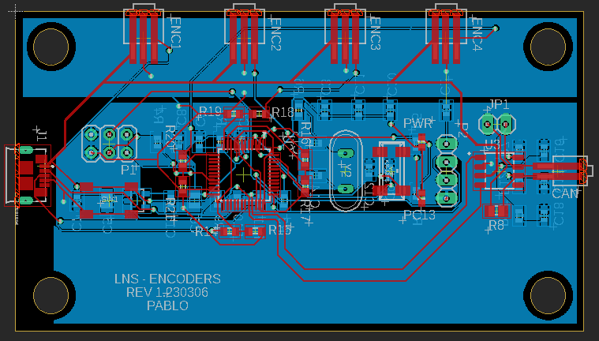
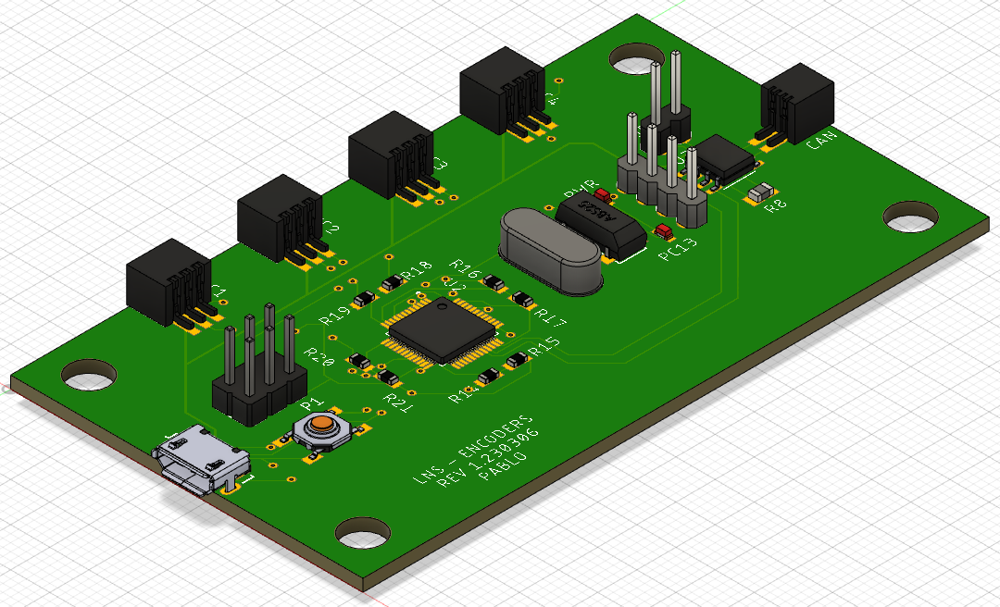

# STM32F103-Encoder-SME360PM

## About The Project
The code and board schematic were designed to read 4 absolute encoders SME360PM of a 4 wheel independent steering robot and transmit the values through CAN interface. The values are read in continous mode and organized using DMA. The board is based on the STM32F103 blue pill.


## Getting Started

1. To request the values the following message must be send:
```sh
  [0x01, 0x00, 0x00, 0x00, 0x42, 0x1, 0x00, 0x00, 0x00, 0x00, 0x00, 0x00, 0x00]
```

2. The python script can be use to read and decode the angles 
```sh
  python3 Python_test_code/test.py
```

## Schematic Files
Schematic and gerber were generated on Eagle.




